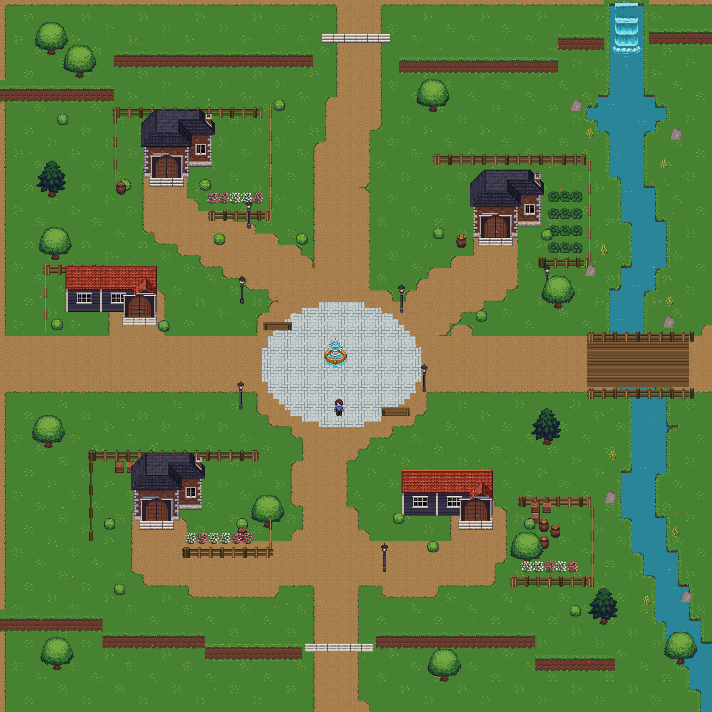

# Havenreach — standalone Godot map playtest

A **2000 × 2000 px** town built from original-scale [ElizaWy/LPC](https://github.com/ElizaWy/LPC) assets, with five accessible houses, four cardinal entrances, native Godot physics, an animated waterfall and animated river reflections. This repository is an isolated map-development project. It has no dependency on, or integration with, the main game.

## Open and play

1. Download this repository as a ZIP and extract it.
2. In **Godot 4.4 or newer**, choose **Import** and select `project.godot`.
3. Let the assets import, then press **F5**.

Tested with Godot **4.7.2**, Compatibility renderer. Godot 3 is not supported. Python is not required to play or edit the baked scene.

| Control | Action |
|---|---|
| WASD / arrow keys | Walk |
| E | Enter a nearby front doorway; leave the test interior |
| R | Reset outside |
| F1 | Show actual physics shapes and doorway triggers |
| F2 | Toggle the exact 64 × 64 sprite-frame outline |
| F3 | Toggle feet collision / full 64 × 64 collision body |
| F4 | Show the whole town |

## Doors and character

Wooden door panels open as the character approaches. Walk up the front steps and press E. Each house leads to a shared **basic interior test room**; E returns to that same house's clear approach. These rooms demonstrate enter/return behavior. Five finished, furnished interiors are not included.

The sample character uses original LPC **64 × 64 animation frames**. Normal collision is a **24 × 16 feet rectangle**, suitable for this top-down perspective. F3 enables an exact **64 × 64 solid rectangle** for stricter clearance testing. Both are real `CharacterBody2D` physics shapes. Full-body mode is only enabled when it will not overlap an obstacle.

## Map and collision editing

Open `scenes/Havenreach.tscn` to inspect or edit the actual town. The scene contains native `TileMapLayer`, `Sprite2D`, `AnimatedSprite2D`, `StaticBody2D`, `CollisionPolygon2D`, and `Area2D` nodes. The world does not use a generated concept image as its background.

- Physics layer 1: world solids; mask 2: test character.
- Physics layer 2: test character; mask 1: world solids.
- Physics layer 3: doorway areas; mask 2: test character.
- Walls have individual footprint polygons, with open doorway channels.
- Trees collide at the trunk, allowing walking behind their canopies.
- River tiles collide; the east bridge has a clear deck with solid rail bases.
- Fences, barrels, crates, shrubs, lamps, fountain and cliff faces have physical footprints.
- F1 reads the scene's real shapes. Red is solid; green marks doorway triggers. It is not a painted collision-mask image.

LPC artwork stays at its native pixel scale. Native 32 px terrain tiles are divided into 16 px atlas cells where necessary so the playable area is exactly 2000 px on each side. No artwork is enlarged to fit the map. Scenery is sorted by its ground contact point.

The waterfall uses four original `Terrain/Waterfall.png` frames at 6 fps. Twenty small reflection/ripple animations use the four-frame rows in `FX/Water Reflections.png`, with offset phases. The river's terrain color remains stable; animated surface details provide its motion.

## Previews

The following images were captured from the running Godot scene:



[Native collision overlay](docs/havenreach-collisions.png) · [Animated water close-up](docs/havenreach-water.gif)

This is the playable reconstruction for Havenreach review. Other towns have not been started.

## Verification and rebuilding

Run the included physics checks:

```sh
godot --headless --path . --script res://tests/test_havenreach.gd
```

They check dimensions, animation frames, all five enter/return links, solid water, bridge clearance, a real CharacterBody2D wall collision, and reachability to all five houses and four entrances with a full 64 × 64 body. Results are saved in `docs/physics-verification.txt`.

The baked scene can be regenerated from the included editable layout data:

```sh
godot --headless --editor --path . --import --quit
godot --headless --path . --script res://tools/build_map.gd
```

This overwrites `scenes/Havenreach.tscn`, so retain manual scene edits before rebuilding. `tools/capture_preview.gd` captures the real scene with a working graphics display. The optional Python layout-source builder requires Pillow and an adjacent `lpc-source` checkout at the commit recorded in `credits/SOURCES.json`, including the character files listed in `credits/CHARACTER-SOURCES.json`.

## Art attribution

Original artwork: ElizaWy and the contributors named in the unmodified credit files in `credits/`. Source repository and exact revision are recorded in `credits/SOURCES.json`; character component paths are in `credits/CHARACTER-SOURCES.json`. Source art is distributed under its stated OGA-BY 3.0 terms. Retain those credits and applicable attribution when reusing the map. Derived assets assemble native LPC pixels for wider open entries and composite the sample character layers.
